<h1 align="center">autoharness</h1>

<p align="center">
  
  
  
  
</p>

**autoharness is a self-learning skill layer for Claude Code.** It **learns** skills from your real
sessions, **merges** same-scenario ones instead of stacking near-duplicates, **updates** them in use,
and **prunes** any that stop getting used — so the layer **stays clean on its own**, **touching only
the skills it wrote itself**.

Same model, different harness — 42% → 78% on CORE-Bench ([HAL](https://arxiv.org/abs/2510.11977)).
The harness does much of the work (swyx's **Big Model vs Big Harness**), yet it's still rebuilt by
hand every model generation. autoharness bets one slice of it — the skill layer — can maintain itself.

| | |
|---|---|
| **Learns from real work** | Each episode is distilled into a skill from the session you were already having — no separate data-collection or replay loop. |
| **Groups, doesn't just pile up** | A new episode doesn't always add a skill — the reflector compares it against what's there and folds same-scenario skills into one, so the layer consolidates by category instead of accreting near-duplicates. |
| **Validated in use, not on a benchmark** | A skill survives by being adhered to in later turns (invocation rate), not a held-out score. No oracle on the active path, and no tokens spent on a dedicated eval. |
| **Only its own skills** | Touches only the skills it generated through this plugin — everything else, whether you wrote it or installed it, is left completely alone. |
| **Evidence kept for later** | Every create/update logs its scenario and decision to a per-skill ledger — the raw material to build a benchmark from real usage if you ever want one. |

## Install

**Requires `python3` on your PATH** — autoharness runs entirely as Python (zero third-party
dependencies); its hooks and MCP server won't fire without it.

```
/plugin marketplace add tigerless-labs/autoharness
/plugin install autoharness@autoharness
```

Restart Claude Code, then check it's live:

```
/plugin    # autoharness@autoharness — enabled
/mcp       # stage_skill — connected
```

Zero config. It now watches your sessions and lands learned skills into `.claude/skills/` in the
background. Cadence and lifecycle thresholds are tunable via `AUTOHARNESS_*` environment variables.

### Update

```
/plugin marketplace update autoharness              # pull the latest release
/plugin update autoharness@autoharness              # then update autoharness (may open the plugin
                                                    # manager — hit Update on autoharness there)
```

Restart Claude Code afterwards — hooks and the MCP server are loaded at session start, so a running
session keeps the old version until relaunched. The installed copy is cached by the version in
`plugin.json`; releases always bump it, which is what makes the update take effect.

### Uninstall

```
claude plugin uninstall autoharness@autoharness     # stops the hooks + MCP server
claude plugin marketplace remove autoharness        # optional — also drops the install source
```

Uninstalling only stops it from running — the skills it landed and its own state live **outside** the
plugin and stay on disk. To clear those too, delete its state dir (`~/.claude/autoharness/` global,
`<repo>/.claude/autoharness/` per project) and the self-authored skills under `.claude/skills/` (each
carries a `self-authored` ledger marker, so they're easy to tell from yours). Your own skills are
never touched.

## How it works

A learning pipeline runs beside the host and stays off its recall path — symbols are plain native
skills, recalled by the host's own name-and-description mechanism as if a human had written them.

<p align="center"></p>

<sub>Diagram source: [`docs/assets/pipeline.mmd`](docs/assets/pipeline.mmd) — re-render to `pipeline.svg` after editing.</sub>

| Component | Role |
|---|---|
| **CAP** · capture | Hook-driven dumb pipe: grabs each turn (user input, agent output, tool I/O), redacts at egress, points back at the host log instead of copying it. |
| **REF** · reflect | At an episode boundary, reads the existing skill index and decides add / merge / patch / delete — emits an intent (body or delta, plus reason and evidence). Proposes only; no write tools. |
| **promoter** · validate·store | The only writer. Lints the intent in memory (safety, structure, ledger, completeness, self-authored-only) and on pass does an atomic rename into the live skill directory. |
| **MNG** · lifecycle | Daemon-free. Ranks symbols by invocation rate per layer, shields new ones during probation, archives the weakest when a mature pool is over capacity. Archives, never deletes. |
| **LED** · ledger | Per-symbol append-only sidecar: why each symbol was born or changed, with evidence and a reflection watermark. Kept out of the skill body so recall stays clean. |

## How it compares

A self-learning skill layer can be validated against a held-out benchmark, or against its own use.
autoharness takes the second — cheaper, and it works on a live host doing open-ended work where no
benchmark exists.

| | Grow unbounded | Offline-gated self-edit<br/>([Self-Harness](https://arxiv.org/abs/2606.09498)) | Timer + daemon<br/>([hermes-agent](https://github.com/NousResearch/hermes-agent)) | autoharness |
| --- | --- | --- | --- | --- |
| Bounds the skill layer | No | Yes | Yes | Yes |
| Validation signal | None | Held-out benchmark score | Wall-clock inactivity | Adherence in use |
| Needs a benchmark / oracle | No | Yes | No | No |
| Needs a resident daemon | No | No | Yes | No |

## Acknowledgements

[NousResearch/hermes-agent](https://github.com/NousResearch/hermes-agent) — studying its
auto-skill-creation and memory-consolidation design helped sharpen autoharness's adherence-based,
daemon-free take.

Built by Tigerless Labs.

## License

[MIT](LICENSE)
