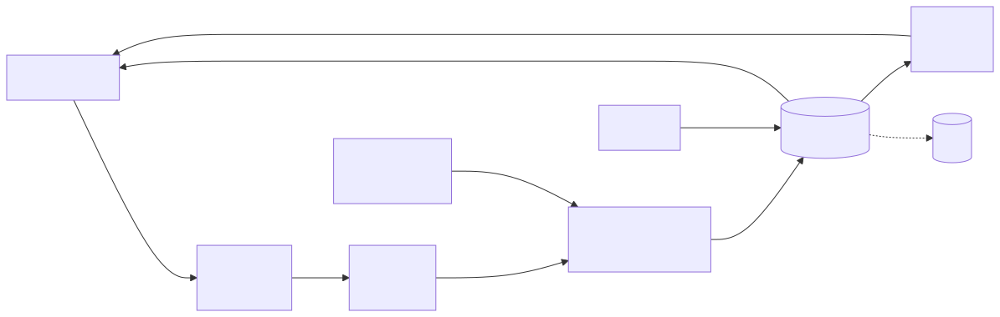

<h1 align="center">AutoHarness</h1>
<p align="center"><strong>Self-Learning Skills for Claude Code</strong></p>

<p align="center">
     
</p>

**autoharness is a self-learning skill layer for Claude Code.** It **learns** skills from your real
sessions, **merges** same-scenario ones instead of stacking near-duplicates, **updates** them in use,
and **prunes** any that stop getting used — so the layer **stays clean on its own**, **touching only
the skills it wrote itself**.

Same model, different harness — 42% → 78% on CORE-Bench ([HAL](https://arxiv.org/abs/2510.11977)).
The harness does much of the work (swyx's **Big Model vs Big Harness**), yet it's still rebuilt by
hand every model generation. autoharness bets one slice of it — the skill layer — can maintain itself.

| | |
|---|---|
| **Learns from real work** | Each episode is distilled into a skill from the session you were already having — no separate data-collection or replay loop. It fires on its own once a session has done enough work; `/learn` distills on demand when you want a lesson kept now. |
| **Groups, doesn't just pile up** | A new episode doesn't always add a skill — the reflector compares it against what's there and folds same-scenario skills into one, so the layer consolidates by category instead of accreting near-duplicates. A fold records which skill absorbed which, so a merge is never mistaken for a death. |
| **Keeps its own library in view** | Every session opens with a grouped index of the skills it wrote, so recall doesn't depend on the host happening to surface them. The host's native recall is left exactly as it was; the index is added on top. |
| **Validated in use, not on a benchmark** | A skill survives by being adhered to in later turns (loads over the requests it was available for), not a held-out score. No oracle on the active path, and no tokens spent on a dedicated eval. |
| **Only its own skills** | Touches only the skills it generated through this plugin — everything else, whether you wrote it or installed it, is left completely alone. |
| **Evidence kept for later** | Every create/update logs its scenario and decision to a per-skill ledger — the raw material to build a benchmark from real usage if you ever want one. |

## Install

**Requires `python3` on your PATH** — autoharness runs entirely as Python (zero third-party
dependencies); its hooks and MCP server won't fire without it.

Type these in the Claude Code input box.

```
/plugin marketplace add tigerless-labs/autoharness
/plugin install autoharness@autoharness
```

Then run `/reload-plugins` (or restart Claude Code).

Zero config. It now watches your sessions and lands learned skills into `.claude/skills/` in the
background. Cadence and lifecycle thresholds are tunable — see [Configuration](#configuration).

Nothing to invoke, but one entry point exists when you want it: **`/learn`** distills the session
you're in right now — say it after working something out and the lesson goes through the same
proposal-and-validation chain the background pass uses.

### Update

Update from a terminal — refresh the catalog, then update with the **full `plugin@marketplace`
id**, then restart:

```
claude plugin marketplace update autoharness       
claude plugin update autoharness@autoharness
```

Then **restart Claude Code** to apply — a version bump is a fresh cached copy, not a hot reload.

The refresh is first on purpose: without it, `update` checks a stale local catalog and may report
`already at the latest version` when a newer release actually shipped.

Third-party marketplaces have auto-update **off** by default. To make future releases hands-off,
enable it once: `/plugin` → **Marketplaces** → **autoharness** → **Enable auto-update**. The
installed copy is cached by the `version` in `plugin.json`; a release reaches users only when that
field is bumped.

### Uninstall

```
claude plugin uninstall autoharness@autoharness     
claude plugin marketplace remove autoharness       
```

Uninstalling only stops it from running — the skills it landed and its own state live **outside** the
plugin and stay on disk. To clear those too, delete its state dir (`~/.claude/autoharness/` global,
`<repo>/.claude/autoharness/` per project) and the self-authored skills under `.claude/skills/` (each
carries a `self-authored` ledger marker, so they're easy to tell from yours). Your own skills are
never touched.

## Configuration

Every knob is an `AUTOHARNESS_*` environment variable with a built-in default — nothing to
configure unless you want to change the pace.

**Cadence — when it learns**

| Variable | Default | What it does |
|---|---|---|
| `AUTOHARNESS_REFLECT_EVERY_N` | `50` | Reflection cadence, counted in **tool calls**, not turns: every main-session tool call advances a counter, and the turn that pushes it past N ends with a background reflection. A working stretch triggers; a conversation that only talks never does. Lower = learns faster and spawns more child sessions. |
| `AUTOHARNESS_CONSOLIDATE_EVERY_N` | `250` | Same quantum for the curator, the periodic pass that merges the library as a whole. Held well above the reflection cadence — consolidation is rarer than distillation. |
| `AUTOHARNESS_DIGEST_EXCHANGES` | `20` | How many exchanges *before* the episode window are compressed into the reflector's prior-context digest (text + tool names only). Unused by the fork carrier, which replays the real conversation instead. |
| `AUTOHARNESS_CARRIER` | `bundle` | What carries the reflection. `bundle` hands a redacted window + digest to a fresh subagent. `fork` resumes and forks the session that just ended, so the reflector reads the real conversation on the parent's warm cache. Stays `bundle` until the cache-hit measurement is in. |

**Recall — what the model sees**

| Variable | Default | What it does |
|---|---|---|
| `AUTOHARNESS_INDEX_SUSPENDED` | `0` | Set to `1` to stop injecting the index entirely. Everything else keeps running — the lifecycle pass, the use/view counters, the last-run summary — so this is the switch for measuring what the index is actually worth, and for anyone unwilling to spend the context on it. |
| `AUTOHARNESS_INDEX_DESC_MAX_CHARS` | `60` | Per-line description budget in the session-start index. The index is a scan surface, not the full trigger text — raise it for longer lines, at the cost of context on every session. |
| `AUTOHARNESS_SKILL_DESC_MAX_CHARS` | `1024` | Hard cap on a skill's own description, matching the host's documented limit; a longer one is rejected rather than silently truncated at load. |
| `AUTOHARNESS_SKILL_BODY_MAX_LINES` | `25` | Altitude cap: a `SKILL.md` body over this many non-blank lines is rejected as a transcript rather than a rule. Backing detail belongs in the skill's `references/`. |

**Lifecycle — what survives**

| Variable | Default | What it does |
|---|---|---|
| `AUTOHARNESS_MATURITY_PROJECT` | `100` | Probation gate, project layer: after this many requests have arrived in its layer since a skill landed, it faces graduation review. Until then it's recalled as usual but can't be archived. |
| `AUTOHARNESS_MATURITY_GLOBAL` | `300` | Same gate for the global layer — higher because a global skill loads in every project. |
| `AUTOHARNESS_CAPACITY_PROJECT` | `50` | Cap on *mature* skills in the project layer. It is also what bounds the session-start index: one line per live skill, so the index can never exceed the two caps combined. For graduates, capacity contention is the only death: nothing is archived until the mature pool exceeds this, then the lowest usage rates go first. |
| `AUTOHARNESS_CAPACITY_GLOBAL` | `20` | Same cap for the global layer — smaller because its blast radius is every project. |
| `AUTOHARNESS_GRADUATION_SUSPENDED` | `0` | Set to `1` to park graduation review entirely, so nothing is archived for going unused. Meant for when you have reason to doubt the recall surface: archiving on zero use would then be punishing skills for never having been offered. Capacity contention still applies. |
| `AUTOHARNESS_SNAPSHOT_KEEP` | `5` | How many pre-run snapshots of each skill tree the curator keeps before merging. A merge is the one operation a single atomic rename can't undo. |

Set them in the environment Claude Code launches with — either the shell
(`export AUTOHARNESS_REFLECT_EVERY_N=10`) or the `env` map in `.claude/settings.json`:

```json
{ "env": { "AUTOHARNESS_REFLECT_EVERY_N": "10" } }
```

Hooks read the environment on every event, so a change applies from the next session. The defaults
are deliberate placeholders pending empirical calibration (tracked under `experiments/`); byte caps
on captured windows and staged files are fixed constants, not env knobs.

## How it works

A learning pipeline runs beside the host. Skills are plain native files, recalled by the host's own
name-and-description mechanism as if a human had written them — that path is left untouched. On top
of it, each session opens with an index of the skills autoharness wrote, so whether its own library
gets offered is a property of this plugin rather than a hope about host behavior.

<p align="center"></p>

<sub>Diagram source: [`docs/assets/pipeline.mmd`](docs/assets/pipeline.mmd) — re-render to `pipeline.svg` after editing.</sub>

| Component | Role |
|---|---|
| **CAP** · capture | Hook-driven dumb pipe: grabs each turn (user input, agent output, tool I/O), redacts at egress, points back at the host log instead of copying it. It also holds the trigger, which is deterministic and counts one thing — tool calls. The turn that crosses the threshold ends with a reflection; nothing about the content is judged here. |
| **REF** · reflect | Reads the episode, compares it against the existing skill index, and decides add / merge / patch / drop a support file / delete — emitting an intent (body, delta, or path, plus reason and evidence). Where a new lesson contradicts an older skill, it must rewrite the stale one in the same run rather than leave the library arguing with itself. Proposes only; it has no write tools, and a fork carrier's inherited ones are denied at the hook. |
| **promoter** · validate·store | The only writer. Lints the intent in memory (safety, structure, ledger, completeness, self-authored-only) and on pass does an atomic rename into the live skill directory. A new skill's description has to carry its trigger early enough to survive the index's truncation — a cue that lands past the cut leaves the skill as half a sentence on the very surface meant to recall it. A fold must name the skill that absorbed the deleted one, and the umbrella has to be a live skill autoharness manages — an invented name fails the whole intent rather than losing the content. Each run leaves an account of what landed and what was rejected. |
| **IDX** · surface | Builds the session-start index: the skills autoharness wrote, grouped by category, one truncated description per line, tagged by layer. Archived and hand-written skills are excluded, an empty library injects nothing, and the previous run's landed/rejected line rides along — so a rejected proposal is visible instead of silent. |
| **MNG** · lifecycle | Daemon-free: recomputed lazily at session start, once per session. Ranks symbols by usage rate — loads over the requests that arrived since the symbol was created, so the measure is opportunity-relative and a closed laptop doesn't age anyone out (the wall-clock replacement). Three signals are kept apart: a **load** (the model invoked the skill) is the only thing the rate counts; a **view** (a session read into the skill's directory) is evidence it had recall value, but not adherence; a **patch** marks the skill being improved, so a load after one reads as reuse-after-improvement. New symbols sit in probation until they've had a fair sample of requests: recalled as usual, but neither counted against the cap nor evictable. At maturity, graduation review archives only a symbol that was never loaded *and* never viewed — no evidence of use is not the same as evidence of no use. For graduates, capacity contention is the only death — nothing is archived until a layer's mature pool exceeds its cap, then the lowest rates go first. Archives, never deletes: an archived symbol is a directory moved out of recall, and moving it back revives it. |
| **curator** · consolidate | The rarer whole-library pass: reads the library as one thing and folds near-duplicates under umbrellas, which is the judgment a single episode can't make. Snapshots both skill trees before it starts, since a merge is the one operation an atomic rename can't undo. |
| **LED** · ledger | Per-symbol append-only sidecar: why each symbol was born or changed, with evidence and a reflection watermark. Kept out of the skill body so recall stays clean. |

## Walkthrough: watching it learn

Everything autoharness does lands on disk as plain files — a demo is just opening them in the
right order. For a fast-paced run, speed up the loop first (see [Configuration](#configuration)):

```json
{ "env": { "AUTOHARNESS_REFLECT_EVERY_N": "3",
           "AUTOHARNESS_MATURITY_PROJECT": "5",
           "AUTOHARNESS_CAPACITY_PROJECT": "2" } }
```

**1 · The pipeline running.** Work a few normal turns on anything non-trivial (debug something,
figure out a workflow). Once a turn pushes the tool-call count past N, a background reflection
fires as that turn ends — nothing blocks your session. Its bookkeeping is visible in the state dir:

```
ls .claude/autoharness/        # per project — ~/.claude/autoharness/ for the global layer
  requests                     # layer request counter (MNG's denominator)
  session-<id>                 # tool calls counted toward the next reflection
  offset-<id>                  # byte watermark: where the last captured window ended
  intents/                     # queued skill proposals awaiting the promoter
  runs/<run-id>.json           # what that run proposed, landed, and rejected — with reasons
  last_run.json                # the summary line awaiting the next session start
  snapshots/                   # skill-tree tarballs the curator takes before merging
```

**2 · A skill is born.** After a reflection lands, a new folder appears under `.claude/skills/`
(project) or `~/.claude/skills/` (global — for techniques that aren't repo-specific). Use `ls -la`:
the interesting files are hidden.

```
.claude/skills/<name>/
  SKILL.md                     # the skill itself — plain native format, nothing proprietary
  .ledger.jsonl                # LED: why it was born / changed (append-only)
  .sidecar.json                # lifecycle counters MNG reads
  references/evidence-*.md     # the transcript slice that justified each ledger entry
  scripts/ templates/ ...      # optional support files the reflector attached
```

**3 · LED — the paper trail.** `cat .ledger.jsonl` — one JSON line per lifecycle event:

```json
{"action": "create", "reason": "User asked about the correct command to update a plugin ...", "evidence": "references/evidence-21cd22cc.md"}
{"action": "patch",  "reason": "User discovered /reload-plugins is required in-session ...",  "evidence": "references/evidence-1a4ec51d.md"}
```

`action` + `reason` + `evidence` — and the evidence file is a real, redacted slice of the session
that taught it, materialized by the promoter (content-addressed, so the model never names files).
This is the "evidence kept for later" from the table above.

**4 · An update, not a duplicate.** Hit the same scenario again with a correction ("that's missing
a step") and let the next reflection run. The skill layer does **not** grow a near-duplicate:
the existing skill's `SKILL.md` changes and its ledger appends a `patch`/`update` line — the
two-line ledger above is a real example. `git diff` on a project-layer skill shows the edit.

**5 · The next session opens knowing.** Start a new session and the first thing it receives is a
grouped index of these skills — plus a one-line report of the last run, so a proposal that got
rejected says so instead of vanishing. The host's own recall still runs untouched underneath;
the index only makes sure the library is in front of the model either way.

**6 · Use is counted three ways.** `cat .sidecar.json`: `use` ticks when the model actually loads
the skill and is the only thing the survival rate counts; `view` ticks when a session reads into
the skill's directory — recall value, but not adherence; `patch` ticks when the promoter lands an
improvement, so a `use` after one is reuse-after-improvement. Keeping them apart is what stops a
skill that was merely browsed from looking like one that was followed.

**7 · Retirement is an archive, not a delete.** Two paths out, both a folder move to
`.claude/skills/.archive/<name>/` — ledger, evidence and all, out of recall. Graduation review
archives a skill only if its whole probation passed with no use *and* no view; after graduation,
once a layer's mature pool exceeds capacity the lowest-usage-rate skills go. Moving the folder
back revives it, history intact. With the shrunk knobs above this fires within one session; at
defaults it takes hundreds of requests. A skill merged into another is archived the same way, but
its ledger names the umbrella that absorbed it — a fold and a pruning stay distinguishable.

**8 · Yours are never touched.** Every autoharness-authored skill carries the ledger marker;
anything without it — skills you wrote or installed — is invisible to the promoter and MNG.

## How it compares

A self-learning skill layer can be validated against a held-out benchmark, or against its own use.
autoharness takes the second — cheaper, and it works on a live host doing open-ended work where no
benchmark exists.

| | Grow unbounded | Offline-gated self-edit<br/>([Self-Harness](https://arxiv.org/abs/2606.09498)) | Timer + daemon<br/>([hermes-agent](https://github.com/NousResearch/hermes-agent)) | autoharness |
| --- | --- | --- | --- | --- |
| Bounds the skill layer | No | Yes | Yes | Yes |
| Validation signal | None | Held-out benchmark score | Wall-clock inactivity | Adherence in use |
| What starts a learning pass | — | An offline batch | Idle time and elapsed days | Work done in the session |
| Puts its own library in front of the model | No | No | Yes | Yes |
| Needs a benchmark / oracle | No | Yes | No | No |
| Needs a resident daemon | No | No | Yes | No |

## Acknowledgements

[NousResearch/hermes-agent](https://github.com/NousResearch/hermes-agent) — studying its
auto-skill-creation and memory-consolidation design helped sharpen autoharness's adherence-based,
daemon-free take.

Built by Tigerless Labs.

## License

[MIT](LICENSE)

---

© Tigerless · [tigerless.ai](https://tigerless.ai) · [tigerless.com](https://www.tigerless.com)
