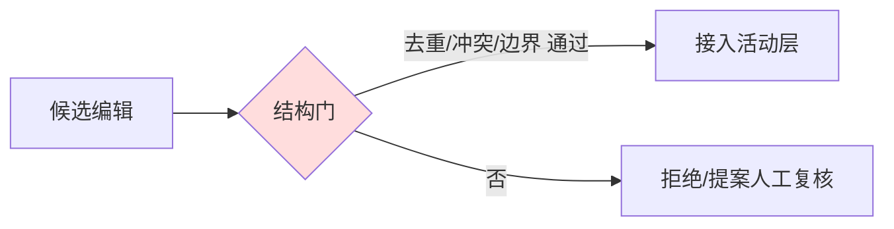

# 设计：harness 编辑把关（草稿 v1）

> 走通样例，待 user 复核。变更原因见 [D-001](../decisions/D-001-edit-gating.md)。

## 元素登记（稳定 ID ↔ provenance）

- `G` 结构门 — 实现 [结构化把关](../ideas/structural-gate-no-oracle.md)（← [SkillOpt](../papers/skillopt.md) 的门、但去掉 oracle）；落地选择见 [D-001](../decisions/D-001-edit-gating.md)
- `A` 活动层接入 — 受控准入，仅结构门通过者进入

provenance：`G → structural-gate-no-oracle → skillopt / autoharness-lou`。
